# 부영기업 AI MES — ERD 설계

> 워크플로우 자동 설계 결과 (11 agents, 32 entities, 9 domains, 34 tables)
> DB: PostgreSQL 16 + pgvector + TimescaleDB (IoT 센서 데이터)

---

## 1. Mermaid ERD 다이어그램

```mermaid
erDiagram
  %% ── 수주·견적 도메인 ──
  customer {
    uuid customer_id PK
    varchar customer_code UK
    varchar customer_name
    jsonb contact_info
    boolean is_deleted
    timestamp created_at
  }
  order {
    uuid order_id PK
    varchar order_no UK
    uuid customer_id FK
    uuid cad_drawing_id FK
    varchar status
    date requested_delivery_date
    boolean is_deleted
    timestamp created_at
  }
  cad_drawing {
    uuid cad_drawing_id PK
    varchar drawing_no UK
    uuid order_id FK
    varchar file_path
    varchar file_type
    jsonb parsed_objects
    varchar parse_status
    timestamp parsed_at
    timestamp created_at
  }
  quote {
    uuid quote_id PK
    varchar quote_no UK
    uuid order_id FK
    uuid ml_model_id FK
    decimal total_amount
    decimal material_cost
    decimal process_cost
    jsonb process_cost_breakdown
    jsonb shap_explanation
    decimal confidence_score
    varchar status
    timestamp created_at
  }
  bom {
    uuid bom_id PK
    uuid order_id FK
    uuid quote_id FK
    varchar bom_version
    varchar status
    timestamp created_at
  }
  bom_line {
    uuid bom_line_id PK
    uuid bom_id FK
    varchar material_code FK
    integer sequence_no
    decimal quantity
    varchar unit
    varchar process_type
    decimal unit_cost
    timestamp created_at
  }

  %% ── 입고·재고 도메인 ──
  supplier {
    uuid supplier_id PK
    varchar supplier_code UK
    varchar supplier_name
    decimal quality_score
    boolean is_deleted
    timestamp created_at
  }
  material {
    uuid material_id PK
    varchar material_code UK
    varchar material_name
    varchar material_type
    varchar unit
    decimal standard_unit_price
    boolean is_deleted
    timestamp created_at
  }
  receiving_lot {
    uuid lot_id PK
    varchar lot_no UK
    uuid supplier_id FK
    varchar material_code FK
    date received_date
    decimal quantity
    decimal weight_kg
    varchar inspection_result
    boolean is_deleted
    timestamp created_at
  }
  inventory_stock {
    uuid stock_id PK
    varchar material_code FK
    varchar location_code
    decimal quantity_on_hand
    decimal quantity_allocated
    decimal quantity_available
    timestamp updated_at
  }
  material_allocation {
    uuid allocation_id PK
    uuid lot_id FK
    uuid work_order_id FK
    decimal quantity
    varchar status
    timestamp allocated_at
    timestamp consumed_at
  }

  %% ── 기준정보 도메인 ──
  work_standard {
    uuid standard_id PK
    varchar standard_code UK
    varchar process_type
    text content
    varchar version
    boolean is_active
    timestamp created_at
  }
  quality_standard {
    uuid qs_id PK
    varchar qs_code UK
    varchar product_type
    varchar process_type
    jsonb criteria
    boolean is_active
    timestamp created_at
  }
  process_routing {
    uuid routing_id PK
    varchar product_type
    integer step_no
    varchar process_type
    uuid qs_id FK
    decimal std_time_min
    boolean is_active
    timestamp created_at
  }

  %% ── 설비·IoT 도메인 ──
  plc_controller {
    uuid plc_id PK
    varchar plc_code UK
    varchar plc_type
    varchar ip_address
    varchar protocol
    boolean is_active
    timestamp created_at
  }
  equipment {
    uuid equipment_id PK
    varchar equipment_code UK
    varchar equipment_name
    varchar process_type
    uuid plc_id FK
    varchar status
    boolean is_deleted
    timestamp created_at
  }
  equipment_sensor_data {
    uuid sensor_record_id PK
    uuid equipment_id FK
    timestamp timestamp
    decimal pressure_mpa
    decimal speed_mpm
    decimal current_a
    decimal voltage_v
    decimal temperature_c
    decimal vibration_mm
    integer production_count
    boolean anomaly_flag
    jsonb raw_payload
  }

  %% ── 공정·생산 도메인 ──
  work_order {
    uuid work_order_id PK
    varchar work_order_no UK
    uuid order_id FK
    uuid bom_id FK
    uuid routing_id FK
    varchar status
    date planned_start_date
    date planned_end_date
    timestamp created_at
  }
  production_lot {
    uuid production_lot_id PK
    varchar production_lot_no UK
    uuid work_order_id FK
    uuid lot_id FK
    varchar process_type
    integer planned_qty
    integer actual_qty
    integer defect_qty
    varchar status
    timestamp started_at
    timestamp completed_at
  }
  forming_process {
    uuid forming_id PK
    uuid production_lot_id FK
    uuid equipment_id FK
    decimal pressure_mpa
    decimal speed_mpm
    decimal temperature_c
    decimal bending_angle_deg
    decimal cut_length_mm
    integer defect_count
    boolean defect_flag
    timestamp recorded_at
  }
  welding_process {
    uuid welding_id PK
    uuid production_lot_id FK
    uuid equipment_id FK
    decimal current_a
    decimal voltage_v
    decimal speed_mpm
    decimal gas_flow_lpm
    varchar bead_image_path
    integer defect_count
    boolean defect_flag
    timestamp recorded_at
  }
  packing_record {
    uuid packing_id PK
    uuid production_lot_id FK
    uuid work_order_id FK
    integer packed_qty
    varchar label_barcode
    jsonb label_info
    varchar status
    timestamp packed_at
  }

  %% ── 품질검사 도메인 ──
  quality_inspection {
    uuid inspection_id PK
    uuid production_lot_id FK
    uuid qs_id FK
    varchar inspection_type
    varchar inspector_id FK
    varchar result
    text remarks
    timestamp inspected_at
  }
  defect_record {
    uuid defect_id PK
    uuid inspection_id FK
    uuid production_lot_id FK
    varchar defect_type
    varchar defect_location
    varchar severity
    text corrective_action
    timestamp recorded_at
  }

  %% ── 출하·물류 도메인 ──
  shipping_order {
    uuid shipping_order_id PK
    varchar shipping_order_no UK
    uuid order_id FK
    uuid customer_id FK
    date planned_ship_date
    varchar shipping_status
    boolean delivery_risk_flag
    timestamp created_at
  }
  shipping_lot {
    uuid shipping_lot_id PK
    uuid shipping_order_id FK
    uuid production_lot_id FK
    integer shipped_qty
    varchar tracking_no
    date shipped_date
    timestamp created_at
  }
  claim {
    uuid claim_id PK
    varchar claim_no UK
    uuid customer_id FK
    uuid shipping_lot_id FK
    varchar claim_type
    varchar claim_severity
    varchar status
    text description
    text root_cause
    date claim_date
    timestamp created_at
  }

  %% ── AI·시스템 도메인 ──
  ml_model {
    uuid model_id PK
    varchar model_name
    varchar model_type
    varchar version
    varchar status
    jsonb metrics
    uuid parent_model_id FK
    boolean is_deleted
    timestamp trained_at
  }
  ml_training_data {
    uuid training_data_id PK
    uuid model_id FK
    uuid quote_id FK
    jsonb features
    decimal label_amount
    boolean is_validated
    timestamp created_at
  }
  ai_agent_query {
    uuid query_id PK
    uuid user_id FK
    varchar session_id
    varchar agent_type
    text query_text
    text response_text
    integer user_feedback_score
    timestamp query_timestamp
  }
  kpi_record {
    uuid kpi_id PK
    varchar kpi_type
    varchar measurement_period
    varchar process_area
    decimal target_value
    decimal actual_value
    varchar status
    date period_start_date
    date period_end_date
    timestamp created_at
  }
  alert_notification {
    uuid alert_id PK
    varchar alert_type
    varchar severity
    varchar source_entity
    uuid source_id
    text message
    boolean is_active
    timestamp created_at
  }
  alert_notification_recipient {
    uuid recipient_id PK
    uuid alert_id FK
    uuid user_id FK
    boolean is_acknowledged
    varchar channel
    timestamp acknowledged_at
  }
  users {
    uuid user_id PK
    varchar username UK
    varchar email
    varchar role
    varchar department
    boolean is_deleted
    timestamp created_at
  }
  system_logs {
    uuid log_id PK
    uuid user_id FK
    varchar action
    varchar target_entity
    uuid target_id
    varchar result
    timestamp timestamp
  }

  %% ── 관계 ──
  customer ||--o{ order : "places"
  order ||--o| cad_drawing : "has"
  order ||--o| quote : "has"
  order ||--o| bom : "has"
  order ||--o{ work_order : "generates"
  order ||--o{ shipping_order : "fulfilled by"
  bom ||--o{ bom_line : "contains"
  bom_line }o--|| material : "uses"
  supplier ||--o{ receiving_lot : "delivers"
  receiving_lot }o--|| material : "is"
  receiving_lot ||--o{ material_allocation : "allocated via"
  inventory_stock }o--|| material : "tracks"
  material_allocation }o--|| work_order : "consumed by"
  work_order ||--o{ production_lot : "produces"
  production_lot }o--|| receiving_lot : "uses raw material"
  production_lot ||--o| forming_process : "forming data"
  production_lot ||--o| welding_process : "welding data"
  production_lot ||--o| packing_record : "packing data"
  production_lot ||--o{ quality_inspection : "inspected by"
  production_lot ||--o{ defect_record : "has defects"
  quality_inspection }o--|| quality_standard : "uses"
  quality_inspection }o--|| users : "performed by"
  defect_record }o--|| quality_inspection : "from"
  process_routing }o--|| quality_standard : "references"
  equipment }o--|| plc_controller : "connected to"
  equipment ||--o{ equipment_sensor_data : "streams"
  equipment ||--o{ forming_process : "runs"
  equipment ||--o{ welding_process : "runs"
  shipping_order }o--|| customer : "for"
  shipping_lot }o--|| shipping_order : "part of"
  shipping_lot }o--|| production_lot : "ships"
  claim }o--|| customer : "from"
  claim }o--|| shipping_lot : "about"
  ml_model ||--o{ ml_training_data : "trained on"
  ml_model }o--o| ml_model : "version of"
  ml_training_data }o--|| quote : "labeled by"
  quote }o--|| ml_model : "predicted by"
  ai_agent_query }o--|| users : "asked by"
  alert_notification ||--o{ alert_notification_recipient : "sent to"
  alert_notification_recipient }o--|| users : "received by"
  system_logs }o--|| users : "by"
  bom }o--|| quote : "generated from"
  work_order }o--|| bom : "uses"
  work_order }o--|| process_routing : "follows"
```



---

## 2. 도메인별 테이블 정의

### 2-1. 수주·견적 도메인

#### customer (고객사)
| 컬럼 | 타입 | NULL | 설명 |
|------|------|------|------|
| customer_id | UUID PK | NO | 고객사 식별자 |
| customer_code | VARCHAR(20) UK | NO | 고객사 코드 |
| customer_name | VARCHAR(100) | NO | 고객사명 |
| contact_info | JSONB | YES | 연락처 정보 (담당자·전화·이메일) |
| is_deleted | BOOLEAN | NO | 소프트 삭제 (DEFAULT FALSE) |
| created_at | TIMESTAMP | NO | 생성일시 |
| updated_at | TIMESTAMP | NO | 수정일시 |

#### order (수주)
| 컬럼 | 타입 | NULL | 설명 |
|------|------|------|------|
| order_id | UUID PK | NO | 수주 식별자 |
| order_no | VARCHAR(30) UK | NO | 수주번호 |
| customer_id | UUID FK | NO | → customer |
| cad_drawing_id | UUID FK | YES | → cad_drawing |
| status | VARCHAR(20) | NO | 상태 (RECEIVED/QUOTED/CONFIRMED/PRODUCED/SHIPPED) |
| product_type | VARCHAR(50) | NO | 제품 유형 (LADDER_TRAY/SOLID_BOTTOM 등) |
| product_spec | JSONB | YES | 제품 사양 (길이·폭·두께·재질) |
| requested_delivery_date | DATE | YES | 요청 납기일 |
| is_deleted | BOOLEAN | NO | DEFAULT FALSE |
| created_at | TIMESTAMP | NO | |
| updated_at | TIMESTAMP | NO | |

#### cad_drawing (CAD 도면)
| 컬럼 | 타입 | NULL | 설명 |
|------|------|------|------|
| cad_drawing_id | UUID PK | NO | 도면 식별자 |
| drawing_no | VARCHAR(50) UK | NO | 도면번호 |
| order_id | UUID FK | NO | → order |
| file_path | VARCHAR(500) | NO | 도면 파일 경로 (S3 등) |
| file_type | VARCHAR(10) | NO | DWG / PDF |
| parsed_objects | JSONB | YES | 파싱 결과 (홀·슬롯·길이·형상·치수) |
| parse_status | VARCHAR(20) | NO | PENDING / COMPLETED / FAILED |
| confidence_score | DECIMAL(5,4) | YES | Parsing + Vision 정합도 |
| parsed_at | TIMESTAMP | YES | 파싱 완료 일시 |
| created_at | TIMESTAMP | NO | |

#### quote (견적)
| 컬럼 | 타입 | NULL | 설명 |
|------|------|------|------|
| quote_id | UUID PK | NO | 견적 식별자 |
| quote_no | VARCHAR(30) UK | NO | 견적번호 |
| order_id | UUID FK | NO | → order |
| ml_model_id | UUID FK | YES | → ml_model (사용된 AI 모델) |
| total_amount | DECIMAL(15,2) | YES | 총 견적금액 |
| material_cost | DECIMAL(15,2) | YES | 자재비 |
| process_cost | DECIMAL(15,2) | YES | 가공비 |
| process_cost_breakdown | JSONB | YES | 공정별 원가 상세 |
| shap_explanation | JSONB | YES | SHAP 기반 원가 영향 변수 |
| confidence_score | DECIMAL(5,4) | YES | 견적 신뢰도 |
| status | VARCHAR(20) | NO | DRAFT / AUTO / REVIEWED / APPROVED |
| estimated_lead_time_days | INTEGER | YES | 예상 납기 (영업일) |
| created_at | TIMESTAMP | NO | |

#### bom (BOM)
| 컬럼 | 타입 | NULL | 설명 |
|------|------|------|------|
| bom_id | UUID PK | NO | BOM 식별자 |
| order_id | UUID FK | NO | → order |
| quote_id | UUID FK | YES | → quote |
| bom_version | VARCHAR(10) | NO | BOM 버전 |
| status | VARCHAR(20) | NO | DRAFT / CONFIRMED |
| created_at | TIMESTAMP | NO | |

#### bom_line (BOM 라인)
| 컬럼 | 타입 | NULL | 설명 |
|------|------|------|------|
| bom_line_id | UUID PK | NO | BOM 라인 식별자 |
| bom_id | UUID FK | NO | → bom |
| material_code | VARCHAR(30) FK | NO | → material |
| sequence_no | INTEGER | NO | 구성 순서 |
| quantity | DECIMAL(10,3) | NO | 소요 수량 |
| unit | VARCHAR(10) | NO | 단위 (EA/M/KG) |
| process_type | VARCHAR(30) | YES | 적용 공정 |
| unit_cost | DECIMAL(12,2) | YES | 단가 |

---

### 2-2. 입고·재고 도메인

#### supplier (공급처)
| 컬럼 | 타입 | NULL | 설명 |
|------|------|------|------|
| supplier_id | UUID PK | NO | 공급처 식별자 |
| supplier_code | VARCHAR(20) UK | NO | 공급처 코드 |
| supplier_name | VARCHAR(100) | NO | 공급처명 |
| quality_score | DECIMAL(3,2) | YES | 품질 평가 점수 (0.00~1.00) |
| is_deleted | BOOLEAN | NO | DEFAULT FALSE |
| created_at | TIMESTAMP | NO | |

#### material (원자재)
| 컬럼 | 타입 | NULL | 설명 |
|------|------|------|------|
| material_id | UUID PK | NO | 원자재 식별자 |
| material_code | VARCHAR(30) UK | NO | 자재 코드 |
| material_name | VARCHAR(100) | NO | 자재명 |
| material_type | VARCHAR(30) | NO | COIL / WIRE / POWDER 등 |
| spec | VARCHAR(100) | YES | 규격 (두께·폭·재질) |
| unit | VARCHAR(10) | NO | 단위 |
| standard_unit_price | DECIMAL(12,2) | YES | 기준 단가 |
| is_deleted | BOOLEAN | NO | DEFAULT FALSE |
| created_at | TIMESTAMP | NO | |

#### receiving_lot (입고 LOT)
| 컬럼 | 타입 | NULL | 설명 |
|------|------|------|------|
| lot_id | UUID PK | NO | LOT 식별자 |
| lot_no | VARCHAR(30) UK | NO | LOT 번호 (Human-readable) |
| supplier_id | UUID FK | NO | → supplier |
| material_code | VARCHAR(30) FK | NO | → material |
| received_date | DATE | NO | 입고일 |
| quantity | DECIMAL(10,3) | NO | 입고 수량 |
| weight_kg | DECIMAL(10,3) | YES | 중량 (kg) |
| thickness_mm | DECIMAL(6,2) | YES | 두께 (mm) |
| inspection_result | VARCHAR(20) | NO | PASS / FAIL / PENDING |
| storage_location | VARCHAR(50) | YES | 보관 위치 |
| is_deleted | BOOLEAN | NO | DEFAULT FALSE |
| created_at | TIMESTAMP | NO | |

#### inventory_stock (재고)
| 컬럼 | 타입 | NULL | 설명 |
|------|------|------|------|
| stock_id | UUID PK | NO | 재고 식별자 |
| material_code | VARCHAR(30) FK | NO | → material |
| location_code | VARCHAR(50) | NO | 보관 위치 코드 |
| quantity_on_hand | DECIMAL(10,3) | NO | 총 보유 수량 |
| quantity_allocated | DECIMAL(10,3) | NO | 예약된 수량 (DEFAULT 0) |
| quantity_available | DECIMAL(10,3) | NO | 가용 수량 (on_hand - allocated) |
| updated_at | TIMESTAMP | NO | |

#### material_allocation (자재 예약·소비)
| 컬럼 | 타입 | NULL | 설명 |
|------|------|------|------|
| allocation_id | UUID PK | NO | 예약 식별자 |
| lot_id | UUID FK | NO | → receiving_lot |
| work_order_id | UUID FK | NO | → work_order |
| quantity | DECIMAL(10,3) | NO | 예약/소비 수량 |
| status | VARCHAR(20) | NO | RESERVED / CONSUMED / RETURNED |
| allocated_at | TIMESTAMP | NO | 예약 일시 |
| consumed_at | TIMESTAMP | YES | 소비 일시 |

---

### 2-3. 기준정보 도메인

#### work_standard (작업표준서)
| 컬럼 | 타입 | NULL | 설명 |
|------|------|------|------|
| standard_id | UUID PK | NO | 표준서 식별자 |
| standard_code | VARCHAR(30) UK | NO | 표준서 코드 |
| process_type | VARCHAR(30) | NO | 적용 공정 |
| content | TEXT | NO | 작업 절차 내용 |
| version | VARCHAR(10) | NO | 버전 |
| embedding_vector | JSONB | YES | Vector DB 임베딩 (pgvector 전환 전 임시) |
| is_active | BOOLEAN | NO | DEFAULT TRUE |
| created_at | TIMESTAMP | NO | |

#### quality_standard (품질 기준)
| 컬럼 | 타입 | NULL | 설명 |
|------|------|------|------|
| qs_id | UUID PK | NO | 품질기준 식별자 |
| qs_code | VARCHAR(30) UK | NO | 기준 코드 |
| product_type | VARCHAR(50) | YES | 적용 제품 유형 |
| process_type | VARCHAR(30) | YES | 적용 공정 |
| criteria | JSONB | NO | 합격 기준 (치수 허용치·불량 유형 등) |
| is_active | BOOLEAN | NO | DEFAULT TRUE |
| created_at | TIMESTAMP | NO | |

#### process_routing (공정 라우팅)
| 컬럼 | 타입 | NULL | 설명 |
|------|------|------|------|
| routing_id | UUID PK | NO | 라우팅 식별자 |
| product_type | VARCHAR(50) | NO | 제품 유형 |
| step_no | INTEGER | NO | 공정 순서 |
| process_type | VARCHAR(30) | NO | FORMING / WELDING / PACKING 등 |
| qs_id | UUID FK | YES | → quality_standard |
| std_time_min | DECIMAL(8,2) | YES | 표준 작업 시간 (분) |
| is_active | BOOLEAN | NO | DEFAULT TRUE |
| created_at | TIMESTAMP | NO | |

---

### 2-4. 설비·IoT 도메인

#### plc_controller (PLC 컨트롤러)
| 컬럼 | 타입 | NULL | 설명 |
|------|------|------|------|
| plc_id | UUID PK | NO | PLC 식별자 |
| plc_code | VARCHAR(20) UK | NO | PLC 코드 |
| plc_type | VARCHAR(20) | NO | MASTER / SLAVE |
| ip_address | VARCHAR(45) | NO | IP 주소 |
| protocol | VARCHAR(20) | NO | OPC-UA / Modbus / MQTT |
| is_active | BOOLEAN | NO | DEFAULT TRUE |
| created_at | TIMESTAMP | NO | |

#### equipment (설비)
| 컬럼 | 타입 | NULL | 설명 |
|------|------|------|------|
| equipment_id | UUID PK | NO | 설비 식별자 |
| equipment_code | VARCHAR(20) UK | NO | 설비 코드 |
| equipment_name | VARCHAR(100) | NO | 설비명 |
| process_type | VARCHAR(30) | NO | FORMING / WELDING / CUTTING 등 |
| plc_id | UUID FK | YES | → plc_controller |
| status | VARCHAR(20) | NO | RUNNING / IDLE / FAULT / MAINTENANCE |
| is_deleted | BOOLEAN | NO | DEFAULT FALSE |
| created_at | TIMESTAMP | NO | |

#### equipment_sensor_data (센서 데이터) — TimescaleDB Hypertable
| 컬럼 | 타입 | NULL | 설명 |
|------|------|------|------|
| sensor_record_id | UUID PK | NO | 센서 레코드 식별자 |
| equipment_id | UUID FK | NO | → equipment |
| timestamp | TIMESTAMP | NO | 수집 일시 (파티셔닝 키) |
| pressure_mpa | DECIMAL(8,3) | YES | 압력 (MPa) |
| speed_mpm | DECIMAL(8,3) | YES | 속도 (m/min) |
| current_a | DECIMAL(8,3) | YES | 전류 (A) |
| voltage_v | DECIMAL(8,3) | YES | 전압 (V) |
| temperature_c | DECIMAL(6,2) | YES | 온도 (°C) |
| vibration_mm | DECIMAL(8,4) | YES | 진동 (mm/s) |
| production_count | INTEGER | YES | 생산 카운트 |
| anomaly_flag | BOOLEAN | NO | 이상 감지 여부 (DEFAULT FALSE) |
| sensor_snapshot | JSONB | YES | 전체 센서 스냅샷 |

---

### 2-5. 공정·생산 도메인

#### work_order (작업지시)
| 컬럼 | 타입 | NULL | 설명 |
|------|------|------|------|
| work_order_id | UUID PK | NO | 작업지시 식별자 |
| work_order_no | VARCHAR(30) UK | NO | 작업지시 번호 |
| order_id | UUID FK | NO | → order |
| bom_id | UUID FK | NO | → bom |
| routing_id | UUID FK | YES | → process_routing |
| status | VARCHAR(20) | NO | PLANNED / IN_PROGRESS / COMPLETED / CANCELLED |
| planned_qty | INTEGER | NO | 계획 수량 |
| planned_start_date | DATE | YES | 계획 시작일 |
| planned_end_date | DATE | YES | 계획 종료일 |
| created_at | TIMESTAMP | NO | |

#### production_lot (생산 LOT)
| 컬럼 | 타입 | NULL | 설명 |
|------|------|------|------|
| production_lot_id | UUID PK | NO | 생산 LOT 식별자 |
| production_lot_no | VARCHAR(30) UK | NO | 생산 LOT 번호 |
| work_order_id | UUID FK | NO | → work_order |
| lot_id | UUID FK | YES | → receiving_lot (투입 원자재) |
| process_type | VARCHAR(30) | NO | 현재 공정 단계 |
| planned_qty | INTEGER | NO | 계획 수량 |
| actual_qty | INTEGER | YES | 실적 수량 |
| defect_qty | INTEGER | YES | 불량 수량 (DEFAULT 0) |
| status | VARCHAR(20) | NO | IN_PROGRESS / COMPLETED / SCRAPPED |
| started_at | TIMESTAMP | YES | 공정 시작 |
| completed_at | TIMESTAMP | YES | 공정 완료 |

#### forming_process (포밍 공정 데이터)
| 컬럼 | 타입 | NULL | 설명 |
|------|------|------|------|
| forming_id | UUID PK | NO | 포밍 레코드 식별자 |
| production_lot_id | UUID FK | NO | → production_lot |
| equipment_id | UUID FK | NO | → equipment |
| pressure_mpa | DECIMAL(8,3) | YES | 작업 압력 (MPa) |
| speed_mpm | DECIMAL(8,3) | YES | 성형 속도 (m/min) |
| temperature_c | DECIMAL(6,2) | YES | 금형 온도 (°C) |
| bending_angle_deg | DECIMAL(6,2) | YES | 절곡 각도 (°) |
| cut_length_mm | DECIMAL(8,2) | YES | 절단 길이 (mm) |
| defect_count | INTEGER | NO | 불량 수량 (DEFAULT 0) |
| defect_flag | BOOLEAN | NO | 불량 발생 여부 (DEFAULT FALSE) |
| recorded_at | TIMESTAMP | NO | 기록 일시 |

#### welding_process (용접 공정 데이터)
| 컬럼 | 타입 | NULL | 설명 |
|------|------|------|------|
| welding_id | UUID PK | NO | 용접 레코드 식별자 |
| production_lot_id | UUID FK | NO | → production_lot |
| equipment_id | UUID FK | NO | → equipment |
| current_a | DECIMAL(8,3) | YES | 용접 전류 (A) |
| voltage_v | DECIMAL(8,3) | YES | 용접 전압 (V) |
| speed_mpm | DECIMAL(8,3) | YES | 용접 속도 (m/min) |
| gas_flow_lpm | DECIMAL(6,2) | YES | 가스 유량 (L/min) |
| wire_feed_mpm | DECIMAL(6,2) | YES | 와이어 송급 속도 (m/min) |
| bead_image_path | VARCHAR(500) | YES | 비드 이미지 경로 |
| defect_count | INTEGER | NO | DEFAULT 0 |
| defect_flag | BOOLEAN | NO | DEFAULT FALSE |
| recorded_at | TIMESTAMP | NO | |

#### packing_record (포장 실적)
| 컬럼 | 타입 | NULL | 설명 |
|------|------|------|------|
| packing_id | UUID PK | NO | 포장 식별자 |
| production_lot_id | UUID FK | NO | → production_lot |
| work_order_id | UUID FK | NO | → work_order |
| packed_qty | INTEGER | NO | 포장 수량 |
| label_barcode | VARCHAR(100) | YES | 바코드/QR |
| label_info | JSONB | YES | 라벨 정보 (제품명·규격·수량) |
| status | VARCHAR(20) | NO | PACKED / SHIPPED |
| packed_at | TIMESTAMP | NO | 포장 완료 일시 |

---

### 2-6. 품질검사 도메인

#### quality_inspection (품질 검사)
| 컬럼 | 타입 | NULL | 설명 |
|------|------|------|------|
| inspection_id | UUID PK | NO | 검사 식별자 |
| production_lot_id | UUID FK | NO | → production_lot |
| qs_id | UUID FK | NO | → quality_standard |
| inspection_type | VARCHAR(20) | NO | INCOMING / IN_PROCESS / FINAL |
| inspector_id | UUID FK | NO | → users |
| result | VARCHAR(10) | NO | PASS / FAIL / HOLD |
| remarks | TEXT | YES | 비고 |
| inspected_at | TIMESTAMP | NO | 검사 일시 |

#### defect_record (불량 이력)
| 컬럼 | 타입 | NULL | 설명 |
|------|------|------|------|
| defect_id | UUID PK | NO | 불량 식별자 |
| inspection_id | UUID FK | NO | → quality_inspection |
| production_lot_id | UUID FK | NO | → production_lot |
| defect_type | VARCHAR(50) | NO | 불량 유형 (치수 불량·용접 결함·스크래치 등) |
| defect_location | VARCHAR(100) | YES | 불량 위치 |
| severity | VARCHAR(20) | NO | CRITICAL / MAJOR / MINOR |
| corrective_action | TEXT | YES | 시정 조치 내용 |
| recorded_at | TIMESTAMP | NO | |

---

### 2-7. 출하·물류 도메인

#### shipping_order (출하 지시)
| 컬럼 | 타입 | NULL | 설명 |
|------|------|------|------|
| shipping_order_id | UUID PK | NO | 출하 지시 식별자 |
| shipping_order_no | VARCHAR(30) UK | NO | 출하 지시 번호 |
| order_id | UUID FK | NO | → order |
| customer_id | UUID FK | NO | → customer |
| planned_ship_date | DATE | YES | 계획 출하일 |
| shipping_status | VARCHAR(20) | NO | PENDING / READY / SHIPPED / DELIVERED |
| delivery_risk_flag | BOOLEAN | NO | 납기 지연 리스크 (DEFAULT FALSE) |
| created_at | TIMESTAMP | NO | |

#### shipping_lot (출하 LOT)
| 컬럼 | 타입 | NULL | 설명 |
|------|------|------|------|
| shipping_lot_id | UUID PK | NO | 출하 LOT 식별자 |
| shipping_order_id | UUID FK | NO | → shipping_order |
| production_lot_id | UUID FK | NO | → production_lot |
| shipped_qty | INTEGER | NO | 출하 수량 |
| tracking_no | VARCHAR(100) | YES | 운송장 번호 |
| shipped_date | DATE | YES | 실제 출하일 |
| created_at | TIMESTAMP | NO | |

#### claim (클레임)
| 컬럼 | 타입 | NULL | 설명 |
|------|------|------|------|
| claim_id | UUID PK | NO | 클레임 식별자 |
| claim_no | VARCHAR(30) UK | NO | 클레임 번호 |
| customer_id | UUID FK | NO | → customer |
| shipping_lot_id | UUID FK | YES | → shipping_lot |
| claim_type | VARCHAR(30) | NO | QUALITY / DELIVERY / QUANTITY 등 |
| claim_severity | VARCHAR(20) | NO | CRITICAL / MAJOR / MINOR |
| status | VARCHAR(20) | NO | OPEN / INVESTIGATING / RESOLVED / CLOSED |
| description | TEXT | NO | 클레임 내용 |
| root_cause | TEXT | YES | 근본 원인 분석 결과 |
| claim_date | DATE | NO | 클레임 접수일 |
| created_at | TIMESTAMP | NO | |

---

### 2-8. AI·시스템 도메인

#### ml_model (ML 모델)
| 컬럼 | 타입 | NULL | 설명 |
|------|------|------|------|
| model_id | UUID PK | NO | 모델 식별자 |
| model_name | VARCHAR(100) | NO | 모델명 (CostEstimationModel 등) |
| model_type | VARCHAR(30) | NO | XGBOOST / YOLO / GNN / LLM |
| version | VARCHAR(20) | NO | 버전 (v1.0 등) |
| status | VARCHAR(20) | NO | TRAINING / ACTIVE / DEPRECATED |
| metrics | JSONB | YES | 성능 지표 (MAPE·F1·R² 등) |
| parent_model_id | UUID FK | YES | → ml_model (이전 버전, 자기참조) |
| is_deleted | BOOLEAN | NO | DEFAULT FALSE |
| trained_at | TIMESTAMP | YES | 학습 완료 일시 |

#### ml_training_data (ML 학습 데이터)
| 컬럼 | 타입 | NULL | 설명 |
|------|------|------|------|
| training_data_id | UUID PK | NO | 학습 데이터 식별자 |
| model_id | UUID FK | NO | → ml_model |
| quote_id | UUID FK | YES | → quote (견적 데이터 연계) |
| features | JSONB | NO | 입력 Feature 벡터 |
| label_amount | DECIMAL(15,2) | YES | 실제 원가 (Label) |
| shap_top_features | JSONB | YES | SHAP Top-N 변수 |
| is_validated | BOOLEAN | NO | 검증 완료 여부 (DEFAULT FALSE) |
| created_at | TIMESTAMP | NO | |

#### ai_agent_query (AI Agent 질의 이력)
| 컬럼 | 타입 | NULL | 설명 |
|------|------|------|------|
| query_id | UUID PK | NO | 질의 식별자 |
| user_id | UUID FK | NO | → users |
| session_id | VARCHAR(100) | YES | 세션 ID |
| agent_type | VARCHAR(30) | NO | RECEIVING / SHIPPING / INTEGRATED |
| query_text | TEXT | NO | 사용자 질의 내용 |
| response_text | TEXT | YES | AI 응답 내용 |
| retrieved_docs | JSONB | YES | RAG 검색된 문서 목록 |
| user_feedback_score | INTEGER | YES | 사용자 피드백 (1~5) |
| query_timestamp | TIMESTAMP | NO | 질의 일시 |

#### kpi_record (KPI 기록)
| 컬럼 | 타입 | NULL | 설명 |
|------|------|------|------|
| kpi_id | UUID PK | NO | KPI 식별자 |
| kpi_type | VARCHAR(50) | NO | HOURLY_OUTPUT / LEAD_TIME / DEFECT_RATE 등 |
| measurement_period | VARCHAR(20) | NO | DAILY / WEEKLY / MONTHLY |
| process_area | VARCHAR(30) | YES | 적용 공정 영역 |
| target_value | DECIMAL(15,4) | NO | 목표값 |
| actual_value | DECIMAL(15,4) | YES | 실적값 |
| status | VARCHAR(20) | NO | ON_TRACK / AT_RISK / MISSED |
| period_start_date | DATE | NO | 기간 시작일 |
| period_end_date | DATE | NO | 기간 종료일 |
| created_at | TIMESTAMP | NO | |

#### alert_notification / alert_notification_recipient
| 컬럼 | 타입 | NULL | 설명 |
|------|------|------|------|
| alert_id | UUID PK | NO | 알림 식별자 |
| alert_type | VARCHAR(50) | NO | EQUIPMENT_FAULT / DELIVERY_RISK / QUALITY_FAIL 등 |
| severity | VARCHAR(20) | NO | CRITICAL / WARNING / INFO |
| source_entity | VARCHAR(50) | YES | 발생 엔티티 (equipment / production_lot 등) |
| source_id | UUID | YES | 발생 레코드 ID |
| message | TEXT | NO | 알림 메시지 |
| is_active | BOOLEAN | NO | DEFAULT TRUE |
| created_at | TIMESTAMP | NO | |

| 컬럼 | 타입 | NULL | 설명 |
|------|------|------|------|
| recipient_id | UUID PK | NO | 수신 식별자 |
| alert_id | UUID FK | NO | → alert_notification |
| user_id | UUID FK | NO | → users |
| is_acknowledged | BOOLEAN | NO | 확인 여부 (DEFAULT FALSE) |
| channel | VARCHAR(20) | NO | IN_APP / EMAIL / SMS |
| acknowledged_at | TIMESTAMP | YES | 확인 일시 |

#### users (사용자)
| 컬럼 | 타입 | NULL | 설명 |
|------|------|------|------|
| user_id | UUID PK | NO | 사용자 식별자 |
| username | VARCHAR(50) UK | NO | 로그인 아이디 |
| email | VARCHAR(200) | YES | 이메일 |
| role | VARCHAR(30) | NO | ADMIN / MANAGER / OPERATOR / INSPECTOR |
| department | VARCHAR(50) | YES | 부서 |
| is_deleted | BOOLEAN | NO | DEFAULT FALSE |
| created_at | TIMESTAMP | NO | |

---

## 3. 인덱스 전략

### 핵심 인덱스

```sql
-- LOT 추적 (Traceability 핵심)
CREATE INDEX idx_production_lot_work_order ON production_lot(work_order_id);
CREATE INDEX idx_production_lot_no ON production_lot(production_lot_no);
CREATE INDEX idx_shipping_lot_production ON shipping_lot(production_lot_id);
CREATE INDEX idx_material_allocation_lot ON material_allocation(lot_id);

-- 실시간 설비 모니터링
CREATE INDEX idx_sensor_equipment_time ON equipment_sensor_data(equipment_id, timestamp DESC);
CREATE INDEX idx_sensor_anomaly ON equipment_sensor_data(anomaly_flag) WHERE anomaly_flag = TRUE;

-- 견적 AI 파이프라인
CREATE INDEX idx_cad_drawing_order ON cad_drawing(order_id);
CREATE INDEX idx_cad_parse_status ON cad_drawing(parse_status) WHERE parse_status = 'PENDING';
CREATE INDEX idx_quote_order ON quote(order_id);

-- 납기 리스크
CREATE INDEX idx_shipping_risk ON shipping_order(delivery_risk_flag) WHERE delivery_risk_flag = TRUE;
CREATE INDEX idx_shipping_planned_date ON shipping_order(planned_ship_date DESC);

-- AI Agent 질의 이력
CREATE INDEX idx_ai_query_session ON ai_agent_query(session_id);
CREATE INDEX idx_ai_query_timestamp ON ai_agent_query(query_timestamp DESC);
```

### 인덱스 전략 요약

| 전략 | 적용 대상 | 이유 |
|------|-----------|------|
| Partial Index | anomaly_flag=TRUE, delivery_risk_flag=TRUE, is_deleted=FALSE | 실제 조회되는 소수 행에만 적용하여 인덱스 크기 최소화 |
| Composite Index | (equipment_id, timestamp DESC) | 설비별 최신 센서 데이터 조회 커버링 인덱스 |
| Unique Partial Index | lot_no WHERE is_deleted=FALSE | 소프트 삭제 환경에서 논리적 유니크 보장 |
| IVFFlat Index (pgvector) | embedding_vector 컬럼 | ANN 벡터 유사도 검색 |
| TimescaleDB Hypertable | equipment_sensor_data | 시계열 IoT 데이터 자동 파티셔닝·압축 |
| Range Partition | system_logs(timestamp) | 로그 월별 파티셔닝으로 아카이브 지원 |

---

## 4. 핵심 설계 결정 사항

### 4-1. UUID PK 전략
모든 테이블 PK를 UUID로 통일. LOT 번호(`lot_no`)는 사람이 읽는 별도 Human-readable 컬럼으로 분리하여 운영. `gen_random_uuid()` (PostgreSQL 13+) 사용.

### 4-2. 소프트 삭제 (is_deleted)
모든 마스터·트랜잭션 테이블에 `is_deleted BOOLEAN DEFAULT FALSE` 적용. FK 참조 무결성 오류 방지, 감사 추적(Audit Trail) 유지.

### 4-3. 재고 수량 3분법
```
quantity_on_hand    = 총 보유 수량
quantity_allocated  = 작업지시에 예약된 수량
quantity_available  = on_hand - allocated (실제 가용)
```
`material_allocation` 테이블이 예약→소비→반납 생명주기를 추적.

### 4-4. IoT 센서 데이터 파티셔닝 — TimescaleDB 권장
```sql
SELECT create_hypertable('equipment_sensor_data', 'timestamp',
    chunk_time_interval => INTERVAL '1 month');
SELECT add_compression_policy('equipment_sensor_data', INTERVAL '7 days');
SELECT add_retention_policy('equipment_sensor_data', INTERVAL '1 year');
```
자동 압축으로 저장 비용 60~90% 절감, 시계열 집계 함수(`time_bucket`)로 KPI 계산 성능 대폭 향상.

### 4-5. ml_model 자기참조 버전 체인
`parent_model_id → ml_model(model_id)` 자기참조 FK로 모델 버전 계보 추적. 롤백 기준 명확화.

### 4-6. JSONB 활용 정책
| 용도 | 컬럼 |
|------|------|
| 제품 사양 | `order.product_spec` |
| CAD 파싱 결과 | `cad_drawing.parsed_objects` |
| SHAP 설명 | `quote.shap_explanation`, `ml_training_data.shap_top_features` |
| 공정별 원가 | `quote.process_cost_breakdown` |
| 품질 기준 | `quality_standard.criteria` |
| 센서 스냅샷 | `equipment_sensor_data.sensor_snapshot` |
| Vector 임베딩 (임시) | `work_standard.embedding_vector` |

### 4-7. Digital Thread 구조
```
customer → order → cad_drawing → quote → bom → bom_line
                ↓
          work_order → production_lot → forming_process
                                     → welding_process
                                     → packing_record
                                     → quality_inspection
                                     → shipping_lot → claim
```
수주번호·도면번호·LOT번호로 전 공정 데이터가 연결되는 단일 디지털 스레드 구조.

---

## 5. 테이블 수 요약

| 도메인 | 테이블 수 | 핵심 테이블 |
|--------|-----------|-------------|
| 수주·견적 | 6 | customer, order, cad_drawing, quote, bom, bom_line |
| 입고·재고 | 5 | supplier, material, receiving_lot, inventory_stock, material_allocation |
| 기준정보 | 3 | work_standard, quality_standard, process_routing |
| 설비·IoT | 3 | plc_controller, equipment, equipment_sensor_data |
| 공정·생산 | 5 | work_order, production_lot, forming_process, welding_process, packing_record |
| 품질검사 | 2 | quality_inspection, defect_record |
| 출하·물류 | 3 | shipping_order, shipping_lot, claim |
| AI·시스템 | 5 | ml_model, ml_training_data, ai_agent_query, kpi_record, alert_notification |
| 시스템관리 | 3 | users, system_logs, alert_notification_recipient |
| **합계** | **35** | |

> `quality_standard`, `process_routing`은 복수 도메인에서 공유하는 물리 테이블 1개.

---

## 6. Vector DB (pgvector) — RAG Agent 지식베이스

정형 DB와 별도로 pgvector에 임베딩 저장. 동일 PostgreSQL 인스턴스에서 운영 가능.

| 컬렉션 | 소스 | 용도 |
|--------|------|------|
| work_standards | work_standard.content | 작업표준서 질의응답 |
| quality_standards | quality_standard.criteria | 품질 기준 판단 |
| equipment_manuals | 설비 매뉴얼 문서 | 설비 이상 대응 가이드 |
| claim_history | claim 이력 + 조치 내용 | 클레임 원인 분석 |
| sop_documents | 각종 SOP 문서 | 작업 절차 가이드 |
| cad_features | cad_drawing.parsed_objects | 유사 도면 검색 |
